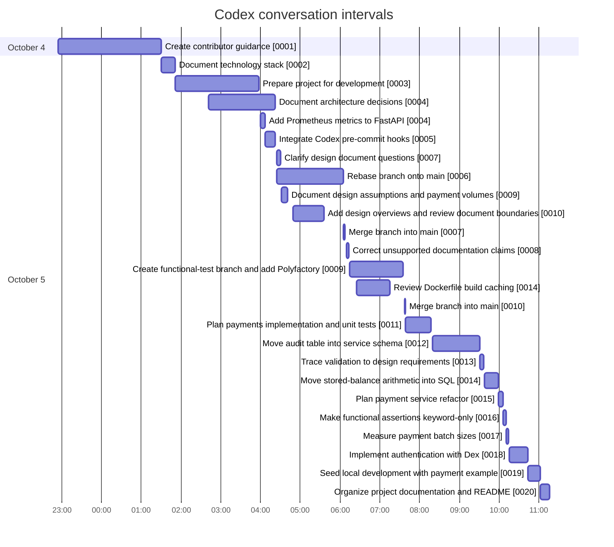

# Codex conversations — October 5, 2026

This index covers all 25 unique conversation files in this folder. The Gantt chart
shows each conversation from its filename start time through its final
timestamped message. Overlapping bars represent parallel conversations; times
are UTC. The first conversation began on October 4.

## Conversation files

| Start (UTC) | Title | Conversation |
|---|---|---|
| Oct 4 22:54 | Create contributor guidance | [0001](./2026-10-04T22-54-30.723Z-0001.md) |
| Oct 5 01:29 | Document technology stack | [0002](./2026-10-05T01-29-49.166Z-0002.md) |
| Oct 5 01:51 | Prepare project for development | [0003](./2026-10-05T01-51-36.166Z-0003.md) |
| Oct 5 02:41 | Document architecture decisions | [0004](./2026-10-05T02-41-13.765Z-0004.md) |
| Oct 5 03:59 | Add FastAPI Prometheus metrics | [0004](./2026-10-05T03-59-48.560Z-0004.md) |
| Oct 5 04:07 | Integrate Codex pre-commit hooks | [0005](./2026-10-05T04-07-17.106Z-0005.md) |
| Oct 5 04:23 | Clarify open design questions | [0007](./2026-10-05T04-23-50.784Z-0007.md) |
| Oct 5 04:24 | Rebase branch onto main | [0006](./2026-10-05T04-24-39.781Z-0006.md) |
| Oct 5 04:31 | Document assumptions and payment volumes | [0009](./2026-10-05T04-31-48.073Z-0009.md) |
| Oct 5 04:49 | Add design overviews and review boundaries | [0010](./2026-10-05T04-49-13.567Z-0010.md) |
| Oct 5 06:05 | Merge branch into main | [0007](./2026-10-05T06-05-22.690Z-0007.md) |
| Oct 5 06:09 | Correct unsupported documentation claims | [0008](./2026-10-05T06-09-45.451Z-0008.md) |
| Oct 5 06:14 | Create test branch and add Polyfactory | [0009](./2026-10-05T06-14-27.731Z-0009.md) |
| Oct 5 06:25 | Review Dockerfile build caching | [0014](./2026-10-05T06-25-02.331Z-0014.md) |
| Oct 5 07:36 | Merge branch into main | [0010](./2026-10-05T07-36-52.182Z-0010.md) |
| Oct 5 07:38 | Plan payments implementation and unit tests | [0011](./2026-10-05T07-38-28.271Z-0011.md) |
| Oct 5 08:19 | Move audit table into service schema | [0012](./2026-10-05T08-19-20.486Z-0012.md) |
| Oct 5 09:31 | Trace validation to design requirements | [0013](./2026-10-05T09-31-16.678Z-0013.md) |
| Oct 5 09:37 | Move stored-balance arithmetic into SQL | [0014](./2026-10-05T09-37-37.723Z-0014.md) |
| Oct 5 09:58 | Plan payment service refactor | [0015](./2026-10-05T09-58-40.863Z-0015.md) |
| Oct 5 10:06 | Make functional assertions keyword-only | [0016](./2026-10-05T10-06-11.455Z-0016.md) |
| Oct 5 10:10 | Measure payment batch sizes | [0017](./2026-10-05T10-10-37.765Z-0017.md) |
| Oct 5 10:15 | Implement authentication with Dex | [0018](./2026-10-05T10-15-18.950Z-0018.md) |
| Oct 5 10:43 | Seed local development with payment example | [0019](./2026-10-05T10-43-31.786Z-0019.md) |
| Oct 5 11:02 | Organize project documentation and README | [0020](./2026-10-05T11-02-05.097Z-0020.md) |
